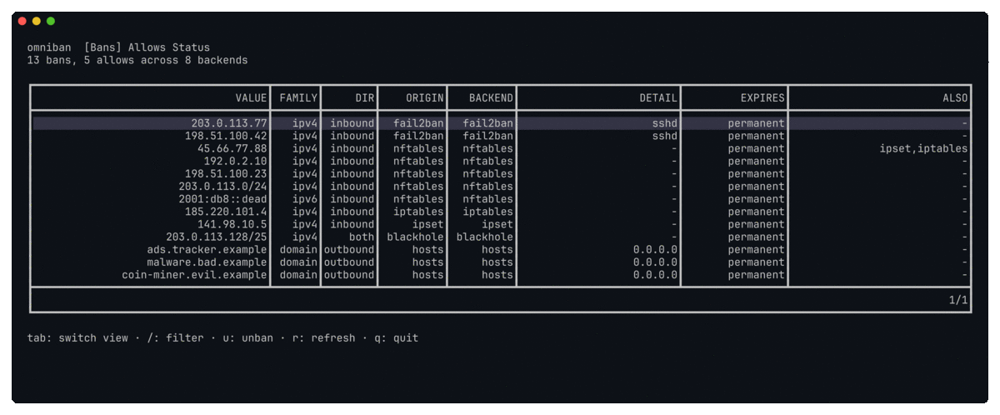
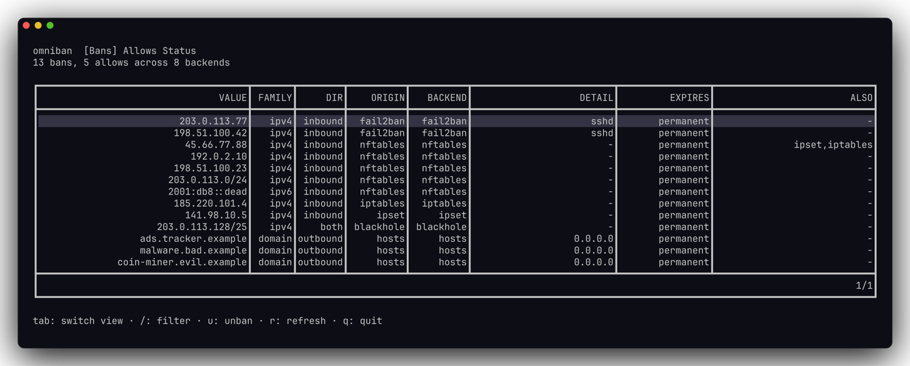
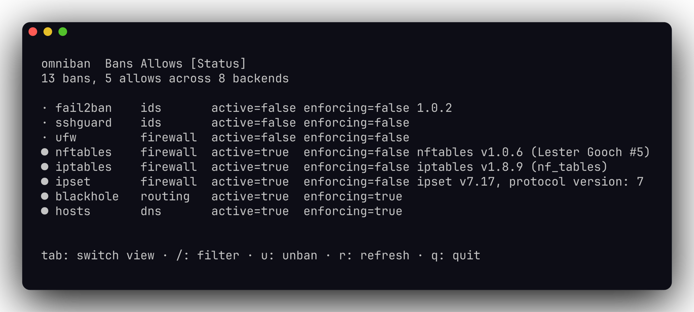
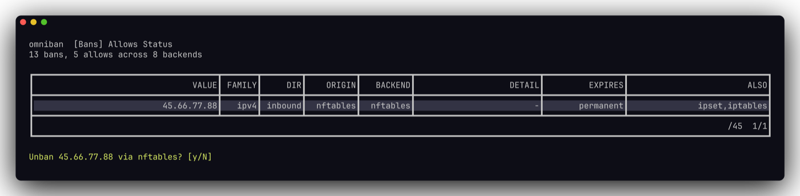

# omniban

**One ban manager for every Linux firewall & IDS.**

[](https://github.com/extremeshok/omniban/releases)
[](LICENSE)
[](go.mod)
[](https://github.com/extremeshok/omniban/releases)

Stop juggling a dozen firewall and intrusion-defense tools. `omniban` is a single
TUI **and** scriptable CLI that shows **every** IP ban, domain sinkhole, and
null-route on a Linux box — each one tagged by the tool that owns it — and lets
you search, add, and remove them through the **correct native backend**, so you
never fight your IDS or clobber another tool's rules.

[**Quick Start**](#quick-start) · [Watch the demo](docs/media/omniban-demo.gif) · [Backends](#supported-backends) · [Usage](#usage) · [Safety](#safety-first)



## Quick Start

**Install (one-liner, standalone binary):**

```sh
curl -fsSL https://raw.githubusercontent.com/extremeshok/omniban/master/scripts/install.sh | sudo bash
```

**Or install the native package:**

```sh
# Debian / Ubuntu
sudo apt install ./omniban_*_linux_amd64.deb
# RHEL / AlmaLinux / Rocky / CloudLinux
sudo dnf install ./omniban_*_linux_amd64.rpm
```

Then just run it:

```sh
sudo omniban            # interactive TUI on a terminal
sudo omniban status     # or go straight to the CLI
```

That's it — omniban auto-detects every ban mechanism already installed. No config
required.

## Why people use it

- **One view of everything.** fail2ban, CrowdSec, CSF, UFW, firewalld, nftables,
  `/etc/hosts`, blackhole routes… all in one source- and direction-labeled list,
  instead of ten different commands and file formats.
- **Never fights your automation.** An IDS-created ban is removed *through the
  IDS* — omniban won't just delete the downstream firewall rule and watch the IDS
  re-add it five seconds later.
- **Never clobbers another tool.** omniban writes only to its own dedicated
  namespaces; everything else is read for attribution only, never modified.
- **Answers "is this IP blocked anywhere?" instantly** — exact, wildcard, or
  CIDR-containment search across every backend at once, hostname or domain too.
- **Safe by default.** Dry-run previews, an audit trail, an undo journal, file
  backups before every edit, and a lockout guard that refuses to ban your own SSH
  session.
- **One static binary.** No runtime, no daemon required, no dependencies — built
  for Ubuntu, Debian, RHEL clones, CloudLinux, and Proxmox.

## Supported backends

omniban speaks each tool's native API and reads every ban back into one unified,
deduplicated list — an IP enforced in five places shows as **one** row owned by
its IDS, with the rest in an `ALSO` column.

| Layer | Backends |
|-------|----------|
| **IDS / detection** | CrowdSec · fail2ban · sshguard · CSF/LFD · APF/BFD · denyhosts · Suricata · Wazuh/OSSEC |
| **Firewall / enforcement** | UFW · firewalld · Shorewall · raw nftables · raw iptables · ipset |
| **Proxy / load balancer** | HAProxy |
| **WAF** | ModSecurity · BunkerWeb |
| **Routing / DNS** | blackhole null-routes (`ip route`) · `/etc/hosts` sinkholes |

**19 backends**, every one supporting list + search + unban (and ban/allow
wherever the tool allows). Each is exercised by live, real-tool end-to-end tests
in privileged containers, not just mocks.

## Usage

```sh
sudo omniban status                       # detected backends + their state
sudo omniban doctor                       # health check + warnings
sudo omniban list                         # every ban/allow, source- + direction-labeled
sudo omniban check 1.2.3.4 --contains     # is this blocked anywhere? (incl. covering CIDRs)
sudo omniban ban evil.example.com --duration 4h   # resolves the host, bans each address
sudo omniban unban 1.2.3.4 --via denyhosts
sudo omniban allow 10.0.0.5               # add to a backend allowlist
sudo omniban sinkhole ads.example.com     # /etc/hosts domain null-route (outbound)
sudo omniban null-route 203.0.113.0/24    # blackhole route (both directions)
sudo omniban undo                         # roll back the last mutating action
```

Run `sudo omniban` with no arguments (on a terminal) for the interactive TUI, or
`sudo omniban tui`. Every command takes `--json` for scripting and `--dry-run` to
preview the exact native command(s) without executing.

### The unified ban list

Every ban across every tool, tagged with its true owner and direction. `AlsoSeenIn`
shows where else the same address is enforced.



### Backend health at a glance



### Unban routes back through the owning tool

Pressing `u` on an IDS-owned ban removes it *through that IDS* — not by deleting a
firewall rule the IDS would just recreate.



## Safety first

A firewall manager that runs as root has to be careful. omniban is:

- **Lockout-proof.** It refuses to ban your current SSH client IP, loopback, the
  host's own addresses, the default gateway, or your admin allowlist without an
  explicit `--force`.
- **Reversible.** Every mutating action is pushed to an undo journal (`omniban
  undo`) and recorded in a sanitized JSON audit log.
- **Non-destructive.** Files like `/etc/hosts`, `hosts.deny`, and persistence
  configs are backed up before any edit.
- **Honest about scope.** Foreign namespaces (`f2b-*`, `crowdsec-*`, firewalld
  zones, the sshguard set) are read for attribution and never written.

## Updating

How omniban updates depends on how it was installed:

- **`.deb` / `.rpm`:** updates come from your package manager
  (`apt-get install --only-upgrade omniban`, `dnf upgrade omniban`). The built-in
  self-updater is **disabled** for packages and points you here.
- **Standalone binary** (the `.tar.gz` or `install.sh`): omniban updates itself.
  The download is verified against the release `checksums.txt` (SHA-256) before
  the running binary is atomically replaced (the old one is kept at `<path>.bak`).

```sh
sudo omniban update                  # update to the latest release
sudo omniban update --check          # report whether a newer version exists (exit 10 if so)
sudo omniban update --enable-timer   # opt in to automatic daily updates (systemd)
sudo omniban update --disable-timer  # turn automatic updates back off
```

`update --check` exits `10` when a newer release is available, so it scripts
cleanly: `if ! omniban update --check; then sudo omniban update; fi`. A passive
"newer version available" notice also appears on `omniban status` for standalone
installs (one check per day; disable with `update_check: false` in the config or
`OMNIBAN_NO_UPDATE_CHECK=1`).

## Build from source

```sh
make build && sudo make install   # needs Go 1.26+
```

## Development

```sh
make all            # fmt, vet, lint, test
make test           # go test -race
make coverage-check
make e2e            # live real-tool end-to-end suite (Docker, privileged)
```

Contributor conventions are in [`AGENTS.md`](AGENTS.md); production criteria and
status in [`docs/PRODUCTION_READINESS.md`](docs/PRODUCTION_READINESS.md). CI runs
via [`extremeshok/poll-ci`](.poll-ci.yml).

## License

BSD 3-Clause. Coded by Adrian Jon Kriel :: admin@extremeshok.com
